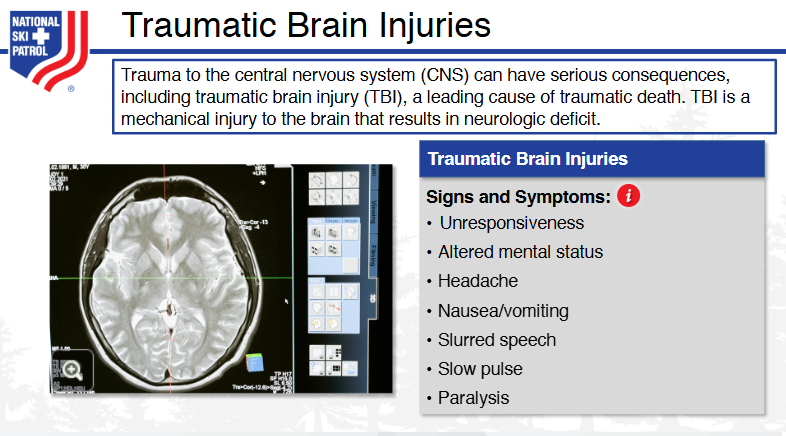
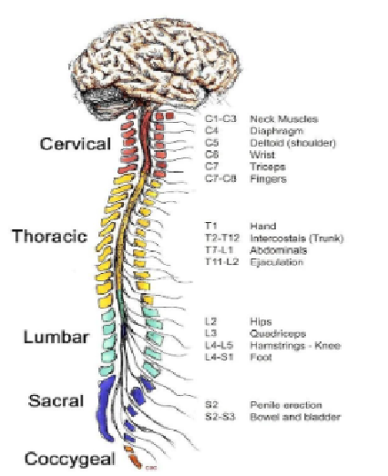
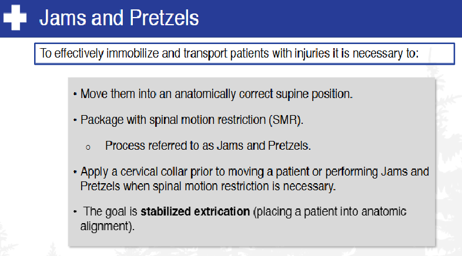
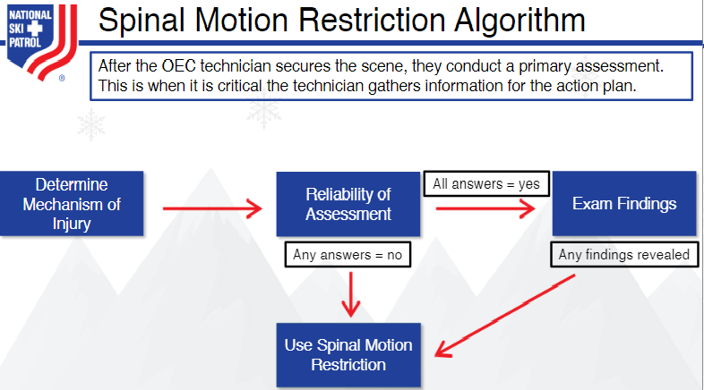
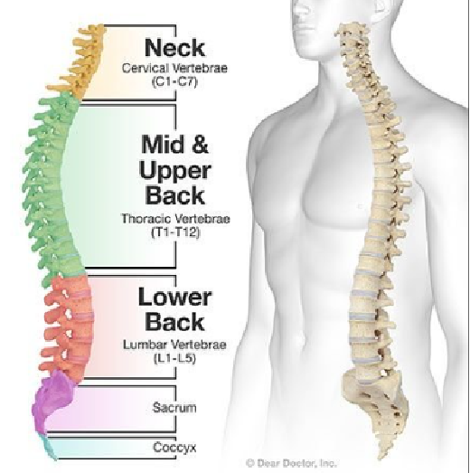

    
# Nsp Oec Training Chapter 21 

## National Ski Patrol - Outdoor Emergency Care chapter 21

    

    
Welcome to the solution **Nsp Oec Training Chapter 21** - an example for your projects

National Ski Patrol - Outdoor Emergency Care chapter 21

    

    
## Getting Started

The goal of this solution is to **Jump Start** your development and have you up and running in 30 minutes. 

To get started with the **Nsp Oec Training Chapter 21** solution repository, follow these steps:
1. Clone the repository to your local machine.
2. Install the required dependencies listed at the top of the notebook.
3. Explore the example code provided in the repository and experiment.
4. Run the notebook and make it your own - **EASY !**
    
## List of Figures
                   
    

## Github https://github.com/JoeEberle/ - Email  josepheberle@outlook.com 
    

    